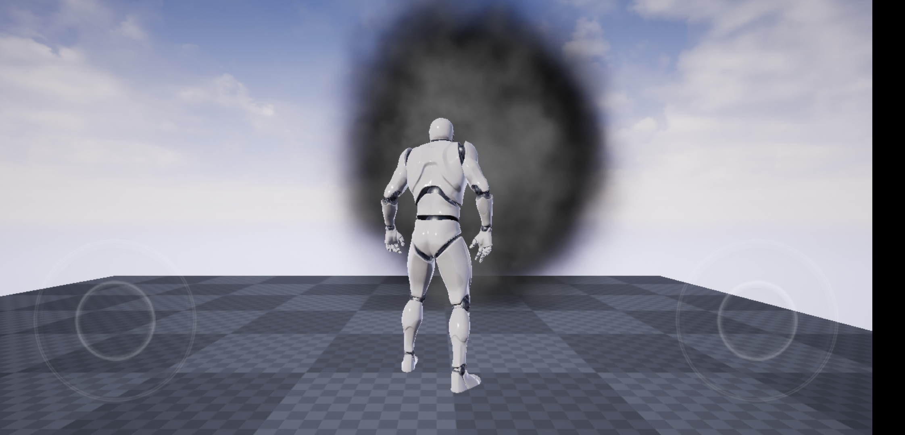
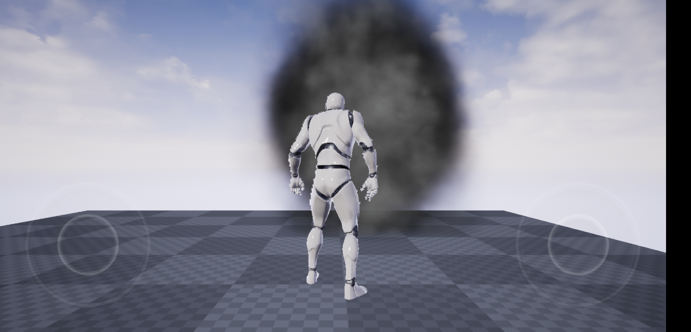
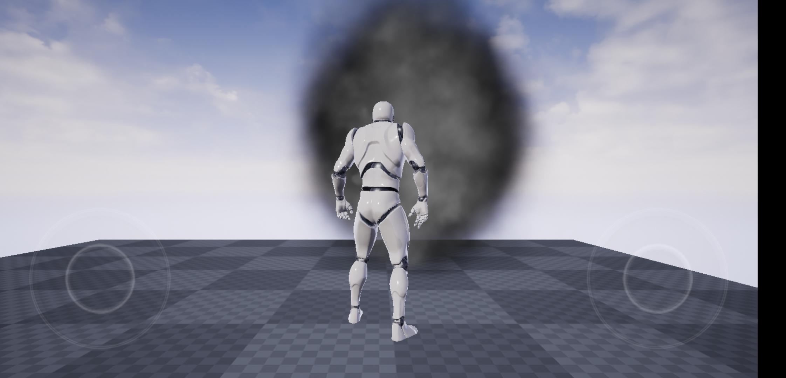
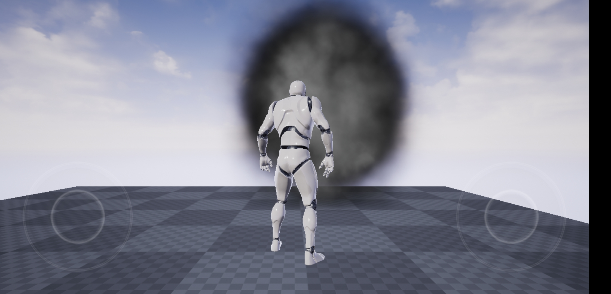

# Off-Screen-Particles

​	Render the Particles to a half-resolusion texture and blend to full resolution according to the depth distribution. If the interpolated depth is closer to the depth of the point sample, the color of the point sample is filled,  otherwise the color of the linear sample is filled.

## Effective Compare

#### GroudTruth

### UE_Effective

In the case of DepthFade, there is aliasing due to direct sampling of SceneColor

### My_Effective

#### DepthLoad

Try to use the original depth texture directly when using DepthFade

#### FrameFetch

## Optimization Result

#### Before：

#### After：

<video src="assets/HUAWEI_META20.mp4"></video>
## How To Use It

- 对于要离屏渲染的材质勾选**bDownSampleSeparateTranslucency**
- 确认Engine中开启**r.Mobile.SeparateTranslucency**

## TIPS

- 低端机本来Shading消耗就比较少，不太适用这个技术，比较适合于中端手机。
- 改进UE算生Nearest算法，改善Artifact