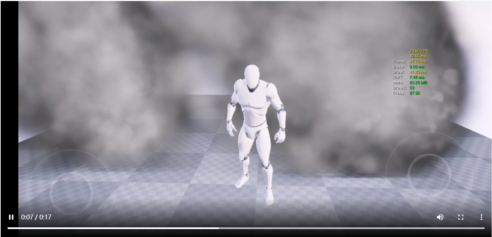
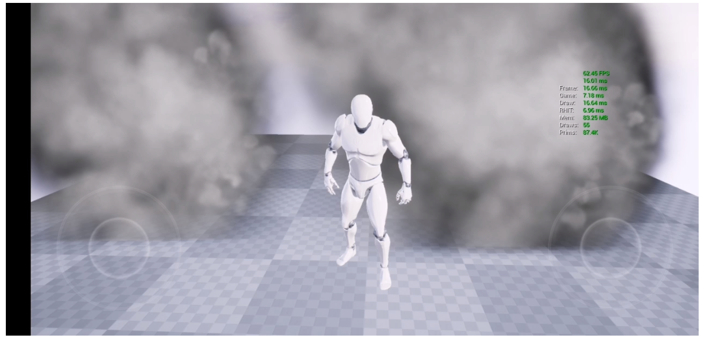
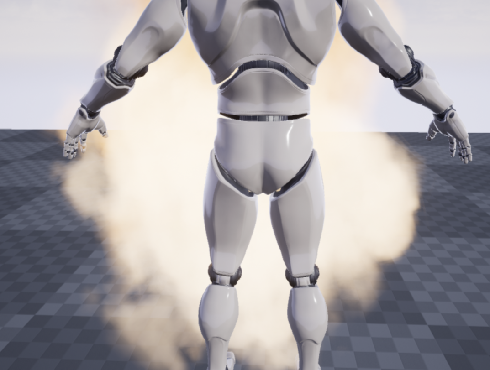
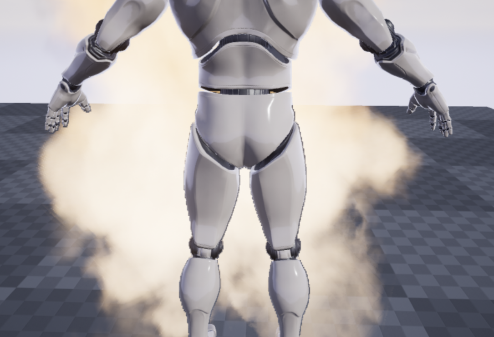
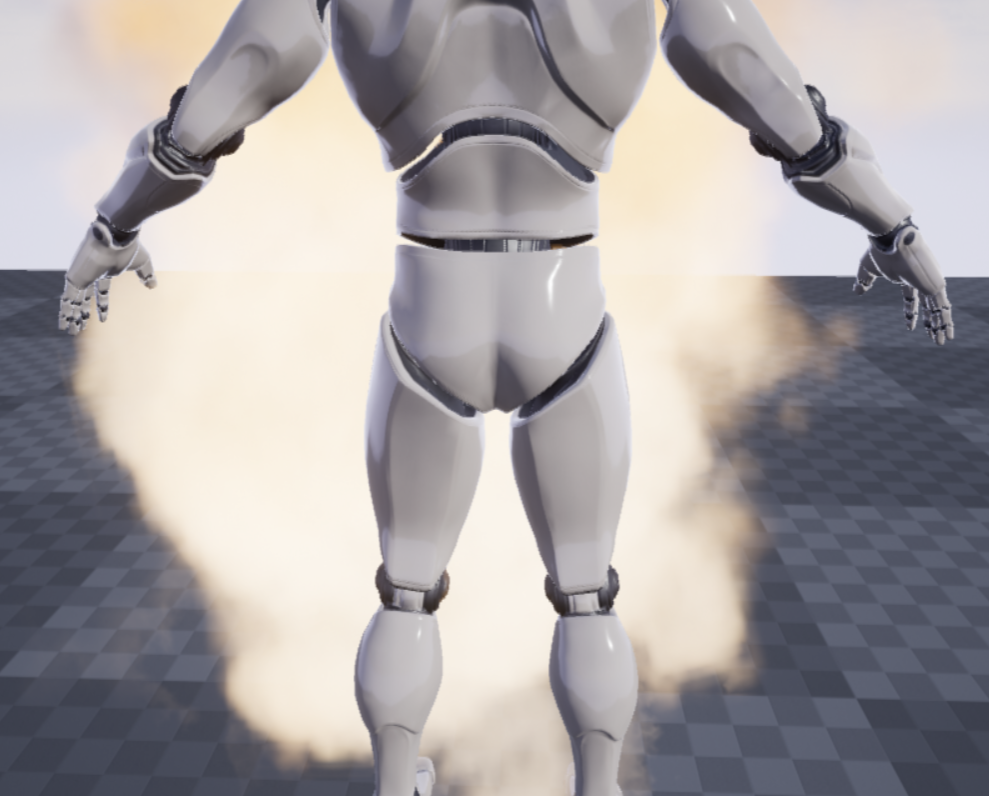
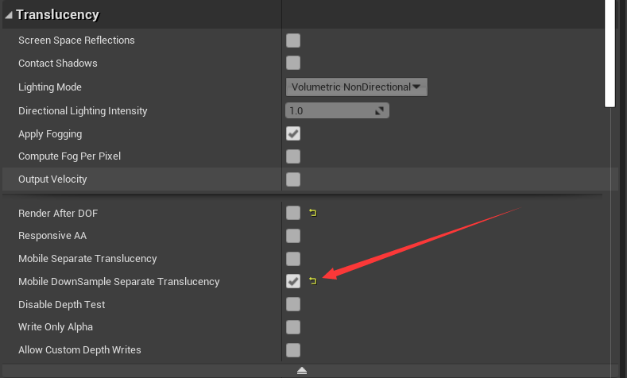

# Off-Screen-Particles

​	Render the Particles to a half-resolusion texture and blend to full resolution according to the depth distribution. If the interpolated depth is closer to the depth of the point sample, the color of the point sample is filled,  otherwise the color of the linear sample is filled.

## Optimization Result

#### Before：

#### After：

<video src="assets/HUAWEI_META20.mp4"></video>

## Anti  Artifact

#### Ground truth

#### BilinearDownSample

#### NearestDownSample

## How To Use It

- 对于要离屏渲染的材质勾选**bDownSampleSeparateTranslucency**
- 确认Engine中开启**r.Mobile.SeparateTranslucency**

## TIPS

- 尽量不要在DownSampleTranslucency的Material使用Depth Fade节点，会增加较多开销。且加剧边缘的**Artifact**
- 低端机本来Shading消耗就比较少，不太适用这个技术，比较适合于中端手机。
- // Because we don’t have a half-resolution SceneColor and cannot use a half-resolution SceneDepth as input，we either use FrameFetchDepth or sample the full-resolution SceneColor directly